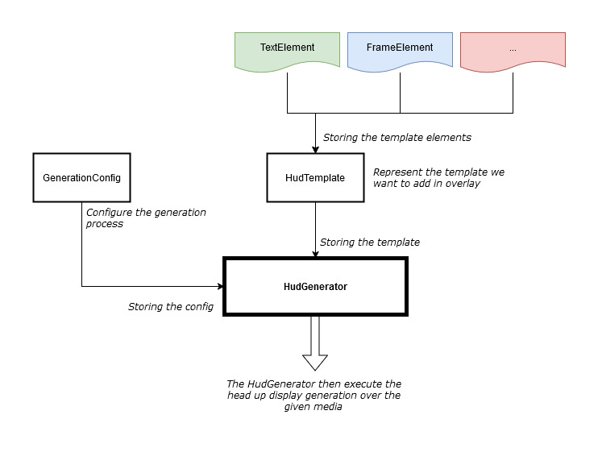
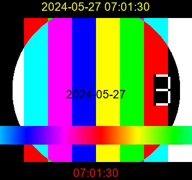

from tempfile import template

# Head up display generator
This is a simple tool to create head up displays (HUD) over media using FFMPEG.
 
ADD IMAGE EXAMPLES

Adding a head up display is a process used in movie/animation/VFX industries to apply in overlay of an input media some visual 
data (text, frame number, logo, etc), mostly for reviewing purpose.

---

# Tool Features

The Head Up Display tool can be used to:
- **Modify the input media**
  - resize the media
  - add black bar on top and bottom

- **Add data in overlay**
    - text [static string or dynamic string from given a dict]
    - date / time [current date, time or datetime]
    - filename / filepath  [from the input media]
    - frame [current frame number]
    - timecode  [current timecode]
    - another image in overlay [logo, etc]

You are also able to:
- **simply position any element in the overlay with keywords ("center", "bottom", "right", etc), or define precise position**
- **automatically scale elements to fit in the black bar or define precise scale**
- **fill template text elements values dynamically using an input dict**
- **export and load templates to/from json files**
- **set up configuration for a project**
- **test templates without input media**
- **export the ffmpeg command in a file in the end**

---

# Installation

- Install FFMPEG locally
- Setup `FFMPEG_PATH` environment variable
- Pip install "head_up_display"

---

# Usage
_For easy and fast learning you can check the `scripts` directory in project and the `examples` directory for the related results_

The generation process is divided in two steps:
- 1 modify input media to resize and add black bar on top and bottom
- 2 add the HUD in overlay

The process in the tool is pretty simple :
- a `HudTemplate` object is storing some `TemplateElement` objects (can be text, an image, frames, etc). This is what define visually the template applied in overlay
- a `HudGenerator` object is storing the `HudTemplate` and the `GenerationConfig` 
- the `HudGenerator` then process the input media and apply the template in overlay 
- 


## Simple usage

This is the simplest way to add a text in overlay:
```python
# 1/ Create a template element (a visual element of your template)
from head_up_display.template_elements.text_element import TextElement
text_filter_01 = TextElement(value='this is my text',
                             color='red',
                             horizontal_position='center', # simple positioning
                             vertical_position='top',
                            ) # Text element is automatically scale to fit in the black bar

# 2/ Create a hud template object (the representation of your overlay)
from head_up_display.template.hud_template import HudTemplate
hud_template = HudTemplate(template_elements=[
        text_filter_01, # add the text element you just created
    ])

# 3/ Create a hud generator object (the one that will modify and apply the overlay on the input media)
from head_up_display.hud.hud_generator import HudGenerator
hud_generator = HudGenerator(hud_template=hud_template)

# 4/ Generate the media with the overlay
hud_generator.generate(source_file='/source/file/media.mp4',
                       destination_file='destination/file/media_with_overlay.mp4',
                       )
```
Note that in this process the source media will be resized and black bar added on top and bottom by default.

If you want to pimp this step you can add a `GenerationConfig` object with custom values to the `HudGenerator` object:
```python
from head_up_display.hud.generation_config import GenerationConfig
config = GenerationConfig(do_resize=True,
                          resize_width=1920,
                          resize_height=1080,
                          add_black_bar=True,
                          black_bar_height=20,
                          )

from head_up_display.hud.hud_generator import HudGenerator
hud_generator = HudGenerator(hud_template=hud_template,
                             generation_config=config,
                             )
```

In your HUD template you can use multiple elements to apply in overlay:
- **text element**: Used to add some static text (same in all generation) or dynamic text (change the value for each generation by giving an input dict)
- **date/time element**: Used to add the current date, time or datetime. You can also modify the format (datetime object)
- **filename/filepath element**: Used to add the input media filename or filepath. You can reduce the length of the filepath to fit your media width
- **frame element**: Used to add the current frame number. Choose the start number and digit number.
- **timecode element**: Used to add the current timecode. Choose the timecode format (according FFMPEG documentation: https://ffmpeg.org/ffmpeg-filters.html#Text-expansion)
- **image element**: Used to add another image in overlay. You can choose the position and size of the image, or keep automatic resize.


## Advanced usage

### Precise and automatic positioning of any text element
You can automatically position any element text (text, date/time, filepath/filename, frame, timecode) in the overlay using keywords.
For **horizontal position** you can use **"left"**, **"center"** or **"right"**. \
For **vertical position** you can use **"top"**, **"center"** or **"bottom"**. \

You can also set up precise positioning using pixel values, it's gonna be the x and y coordinate from the top left corner of media.


### Automatic resize of text element (text, frame, etc) all or some only
You can resize text elements (text, date/time, filepath/filename, frame, timecode) to fit in the black bar size.
You can force to resize everything or only the one with `0` as font_size value.
```python
from head_up_display.hud.generation_config import GenerationConfig
config = GenerationConfig(auto_scale_hud_elements=True, # True to automatically scale text elements
                          override_existing_size_values=False, # False will automatically resize element only if 
                                                               # their `font_size` attribute value is 0
                          )
```
According the `override_existing_size_values` attribute value you may have to set `font_size` to 0 in your text element to be resized.

### Testing a templates without input media
You can generate a simple media for a given template, pretty useful to setup templates 
```python
from head_up_display.hud.hud_generator import HudGenerator

HudGenerator.test_given_hud_template(hud_template=HudTemplate,
                                     generation_config=None, # Or a GenerationConfig object
                                     text_elements_data=None, # Or a dict if you have dynamic text elements
                                     output_file=None, # Or a path to export the test
                                     source_width = 720,
                                     source_height = 480,                                   
                                     )

```

You can also generate it for a template json file
```python
from head_up_display.hud.hud_generator import HudGenerator
HudGenerator.test_given_hud_template_from_file(hud_template_filepath='/path/to/template/as/json/file.json',
                                               generation_config=None, # Or a GenerationConfig object
                                               text_elements_data=None, # Or a dict if you have dynamic text elements
                                               output_file=None, # Or a path to export the test
                                               source_width= 720,
                                               source_height= 480,                                   
                                               )

```

This will give you something like that: \



### Exporting and loading templates as json files

You can save your template in json files and load them later. Nice to build a huge library of templates.
```python
from head_up_display.template.hud_template import HudTemplate

template = HudTemplate(template_elements=[...]) # Inside you store each template element
template.export_template_to_json_file(json_file='/path/to/export/template.json')
```
And to load it
```python
from head_up_display.template.hud_template import HudTemplate

template = HudTemplate.from_template_json_file(json_file='/path/to/export/template.json')
```

### Fill text element dynamically
The text element has two behaviors:

Write a static text in overlay:
```python
from head_up_display.template_elements.text_element import TextElement
text_filter_01 = TextElement(value='this is my text')

from head_up_display.template.hud_template import HudTemplate
template = HudTemplate(template_elements=[text_filter_01])

# From here it will always write "this is my text" in overlay
```

Write a dynamic value based on a dict input
```python
from head_up_display.template_elements.text_element import TextElement
text_filter_01 = TextElement(value='',  # Or whatever value, it will be erased
                             text_id='foo', # This ID is the key in the dict you will give in the generation method
                             )

from head_up_display.template.hud_template import HudTemplate
template = HudTemplate(template_elements=[text_filter_01])

from head_up_display.hud.hud_generator import HudGenerator

generator = HudGenerator(hud_template=template)

generator.generate(source_file='/source/file/media.mp4',
                   destination_file='destination/file/media_with_overlay.mp4',
                   text_elements_data={'foo': 'this is my text'}, # This will replace the value of the text element
                   )
```

### Resize image element
Adding images in overlay using a ImageElement allow you to resize it. Note that it will slower a little the process 
because FFMPEG has to do the resize. **No automatic resize for now.**
```python
from head_up_display.template_elements.image_element import ImageElement

image = ImageElement(image_path='/path/to/image.png',
                     width=35, # In pixel
                     height=35, # In pixel
                     )
```

### Configurate process for a project using env variables

The GenerationConfig class inherit from pydantic `BaseSettings`. It means each attribute can be set by an environment variable (except pydantic 
specific attribute) : \
See: https://docs.pydantic.dev/latest/concepts/pydantic_settings/

The settings will be loaded from environment variables through `prefix` + `class attribute`.
The default prefix name is defined in `head_up_display/constants.py` file.
```python
from head_up_display.hud.generation_config import GenerationConfig
import os

# Example to set up a specific value in the environment variable
os.environ['hud_generation_config__do_resize'] = 'False'
os.environ['hud_generation_config__resize_width'] = '1200'

# Init the configuration will load environment variables values if defined
# Default value will be used if the environment variable is not set
config = GenerationConfig()

print(config.model_dump())
# >>> {'do_resize': False, 'resize_width': 1200, 'resize_height': 1920, 'add_black_bar': True, 'black_bar_height': 20, 'auto_scale_hud_elements': True, 'override_existing_size_values': False, 'ffmpeg_command_as_file': False}
```
Note that the environment variable type is automatically converted (from string to bool, int, etc)


# Tool Architecture

**Inheritance:**
- FFMPEGWrapper
- GenerationConfig
- HudGenerator
- Hud template
- Template elements
- ElementPosition
   - TemplateElement
      - BaseTextElement
         - TextElement
         - FrameElement
         - TimecodeElement
         - FilepathElement
         - DatetimeElement
      - ImageElement

**Composition:**
- HudGenerator
   - HudTemplate
      - TemplateElement
         - TextElement
         - FrameElement
         - TimecodeElement
         - FilepathElement
         - DatetimeElement
         - ImageElement
   - GenerationConfig
   - FFMPEGWrapper

### Generate "empty" media for tests purpose
Test color bars \
`ffmpeg -f lavfi -i testsrc -t 30 -pix_fmt yuv420p testsrc.mp4`

Test red media \
`ffmpeg -f lavfi -i color=color=red -t 30 red.mp4`

Extract a single frame from a media \
`ffmpeg -i input.mp4 -frames:v 1 first.jpg`

